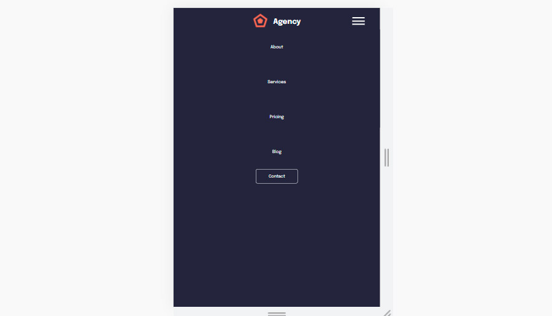

# Модуль отображения заявок на перевозку с адресами доставки

Используемые библиотеки с открытым исходным кодом:

- [ReactJS] - JavaScript-библиотека для создания пользовательских интерфейсов!
- [React - Query] - Библиотека для получения, кэширования, синхронизации и обновления "серверного" состояния в React-приложениях.
- [Axios] - Библиотека с открытым исходным кодом, позволяющая делать HTTP-запросы
- [JSON Server] - Сервер для создания fake API

## Установка

1. Скопировать файлы в папку с программой. На компьютере обязательно должна быть установлена Node.js.
2. Открыть терминал ОС в папке с файлами и запустить команду: npm install
3. После установки в терминале набрать команду npm run server, моковый сервер должен запуститься на http://localhost:3004/
4. Открыть второе окно терминала, набрать команду npm start, React App должен запуститься на http://localhost:3000/

## Использование

